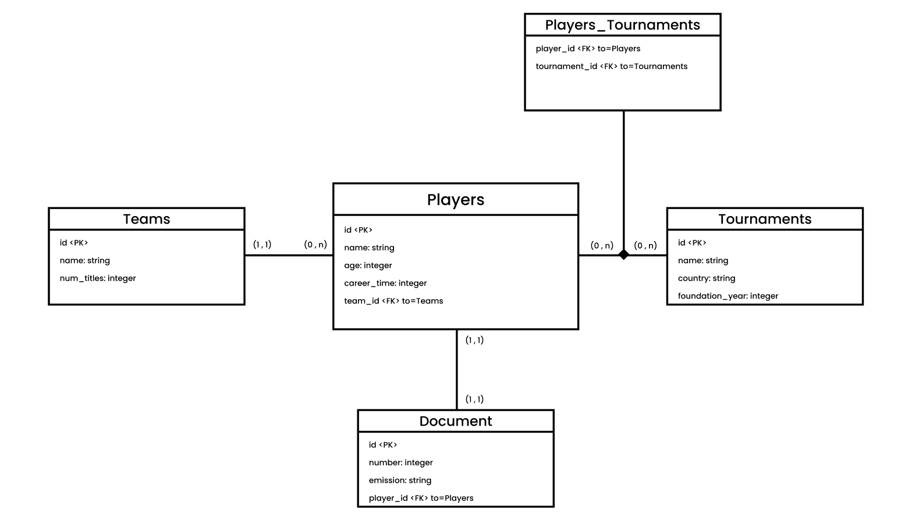

# Trabalho 2 de Programação Web

## Diagrama UML do Bando de Dados

Na imagem acima é possível observar quais são as tabelas, sendo elas:

- Tabelas:
  - Players;
  - Teams;
  - Tournaments;
  - Document;

E suas respectivas relações existentes, sendo:

- (1 , 1) entre Players e Document;
- (1, n ) entre Players e Teams;
- (n , n) entre Players e Tournaments;

## Como funciona

Ao acessar pela primeira vez o diretório, o banco de dados ainda não deverá ter sido montado, para tanto, basta rodar o script start.sh ("./start.sh"), que o mesmo irá criar o banco de dados, as tabelas e, além disso, irá populá-las com alguns registros iniciais;
